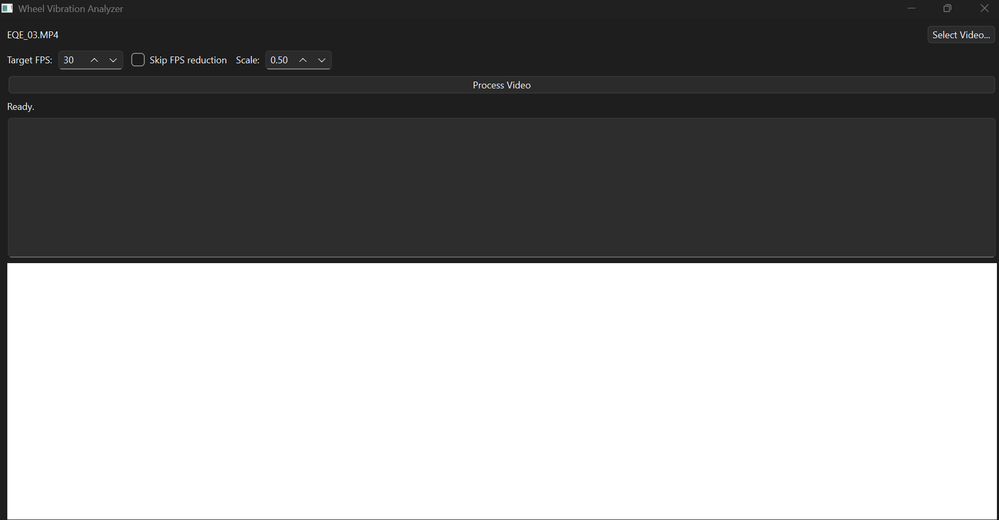
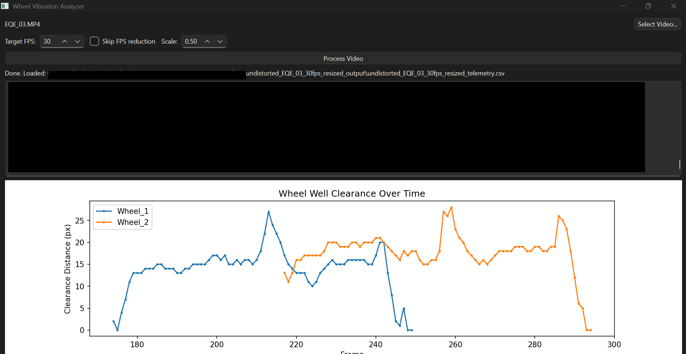
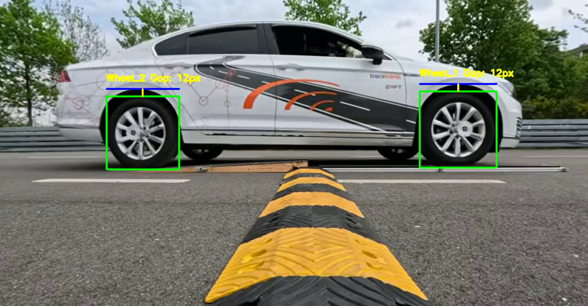

# Wheel Vibration Analyzer

A PySide6 desktop app that processes suspension footage and visualizes wheel
vibration. Select a video, optionally adjust FPS/scale, and the app runs it
through an automated pipeline (FPS reduction → resize → lens distortion
correction → YOLO wheel detection/tracking) to measure wheel-well clearance
per frame, then plots the result as a graph.







## Requirements

- Python 3.9+
- The following Python packages:
  - `PySide6`
  - `matplotlib`
  - `pandas`
  - `opencv-python`
  - `numpy`
  - `ultralytics`

## Installation

1. **Clone or download this project.**

2. **Install dependencies:**

   ```bash
   pip install PySide6 matplotlib pandas opencv-python numpy ultralytics
   ```

   On some systems (e.g. Debian/Ubuntu with externally-managed Python), you
   may need:

   ```bash
   pip install PySide6 matplotlib pandas opencv-python numpy ultralytics --break-system-packages
   ```

3. **Check project structure.** The app expects the four processing scripts
   inside a `video_manipulation/` folder, next to `app.py`:

   ```
   SuspensionApp/
   ├── app.py
   ├── video_manipulation/
   │   ├── reduce_fps.py
   │   ├── resize_video.py
   │   ├── barrelDistortionFix.py
   │   └── detect_build_WheelCsv.py
   └── yolov11nWheel.pt
   ```

4. **Make sure the YOLO weights file** (`yolov11nWheel.pt`) is present in the
   working directory you'll run the app from (or update the path inside
   `detect_build_WheelCsv.py` if you store it elsewhere).

## Running the app

From the project's root folder (the one containing `app.py` and
`video_manipulation/`), run:

```bash
python app.py
```

## Using the app

1. Click **"Select Video..."** and choose your input video file
   (`.mp4`, `.MP4`, `.avi`, `.mov`, `.mkv`).
2. Set the **Target FPS** and **Scale** you want, or check
   **"Skip FPS reduction"** to keep the video's original frame rate.
3. Click **"Process Video"**. The pipeline will run in the background:
   - Reduce FPS (unless skipped)
   - Resize
   - Correct lens distortion
   - Detect and track wheels, generating a telemetry CSV
4. Progress and script output are shown in the log box as it runs.
5. Once finished, a graph of **wheel-well clearance vs. frame number**
   will be displayed at the bottom of the window.

## Output files

After a successful run, in the same folder as your input video you'll find:

- The **final tracked video** (`undistorted_..._resized.MP4`) — has YOLO
  bounding boxes and wheel-well overlays drawn on it.
- A **`..._output/`** folder containing the **telemetry CSV**
  (`..._telemetry.csv`) with per-frame wheel clearance data.

Intermediate files (the FPS-reduced and resized versions) are automatically
deleted after a successful run, keeping only the original video, the final
tracked video, and the CSV.

## Troubleshooting

- **`ImportError: Failed to import any of the following Qt binding modules`**
  — Install PySide6: `pip install PySide6`.
- **"Expected output not found" errors** — Usually means one of the
  `video_manipulation/` scripts is naming its output file differently than
  the app expects. Check the log box for the exact command that was run and
  compare it against the script's actual output filename.
- **Processing is slow** — YOLO inference runs on every frame; larger/longer
  videos and higher-resolution scale settings will take longer, especially
  on CPU-only machines.
